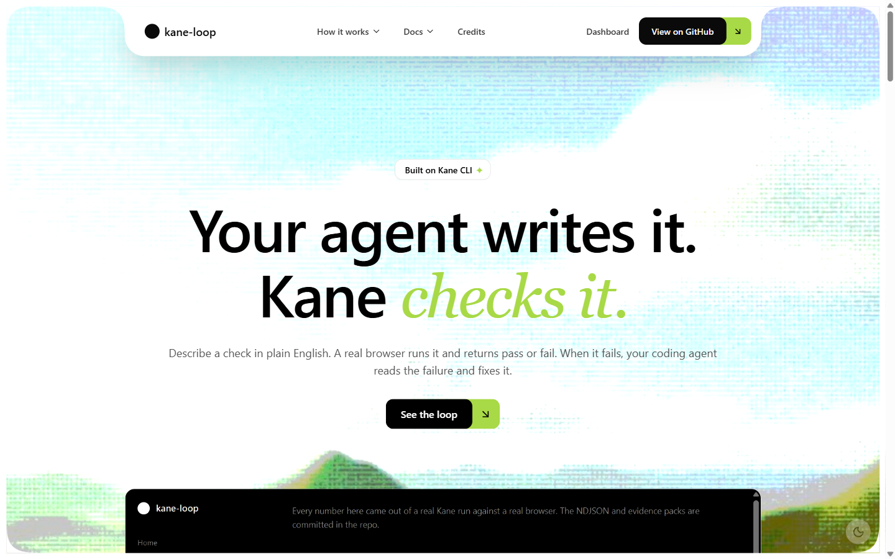
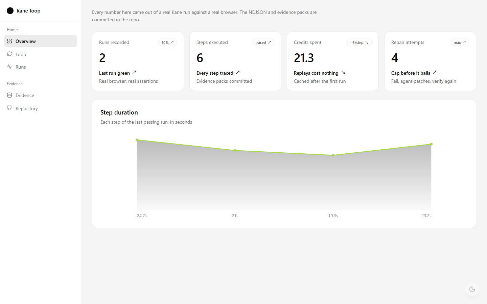
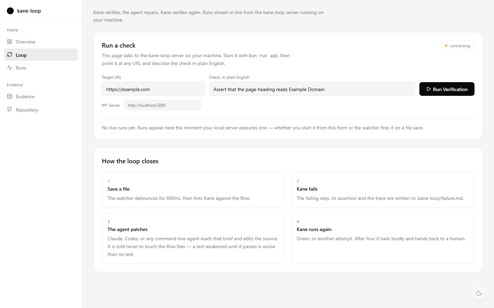
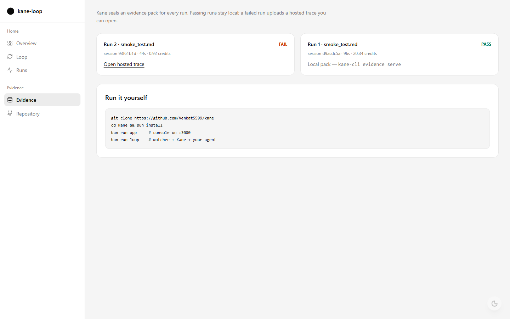
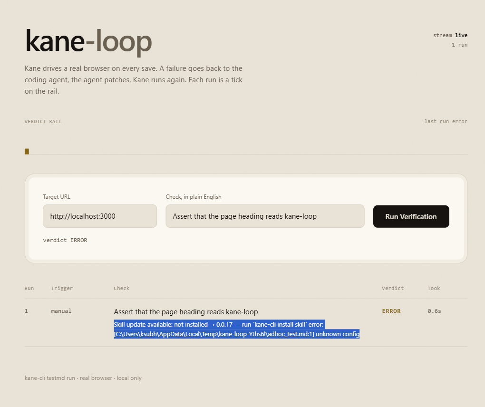

<p align="center">
  
</p>

<p align="center">
  
</p>

<h1 align="center">kane-loop</h1>

<p align="center">
  <strong>Your agent writes it. Kane checks it. — a closed verify-and-repair loop for AI-written code</strong>
</p>

<p align="center">
  
  
  
  
  
  
</p>

<p align="center">
  <a href="https://kane-loop.vercel.app">🌐 Live App</a> &nbsp;|&nbsp;
  <a href="https://github.com/Venkat5599/kane">💻 GitHub</a> &nbsp;|&nbsp;
  <a href="./ARCHITECTURE.md">🏗️ Architecture</a> &nbsp;|&nbsp;
  <a href="https://x.com/Archuser__">🐦 Twitter</a> &nbsp;|&nbsp;
  <a href="https://linkedin.com/in/venkata-ramana-komari-402058316">👤 LinkedIn</a>
</p>

---

## Project Overview

**Problem Statement:** AI coding agents write code faster than anyone can check it. The unclosed part of the loop is trust — when the agent ships, a human still has to open a browser and click through the flow. An agent that cannot observe its own output runs open-loop, and every regression it introduces survives until a person notices.

**Solution:** kane-loop is a local dev-loop daemon. A watcher fires Kane CLI against your running app on every save; Kane drives a real Chrome window through a plain-English flow and returns a verdict. On PASS the console shows a green iteration. On FAIL the failing step, its assertion, a console excerpt and the trace path are written to `.kane-loop/failure.md`, and a coding agent (Claude Code or Codex) is spawned with that brief as context. The agent edits the source, the save refires the watcher, Kane runs again. Four attempts without green and it bails loudly rather than looping forever.

The console it streams to is itself the app Kane verifies — the loop verifies the thing that renders the loop.

**Relevance:** real browser verification (not mocked), machine-readable verdicts an agent can act on with no human relay, a Claude Code `PostToolUse` hook that fires one verification per agent edit, and committed NDJSON evidence from real runs.

---

## Technical Architecture

```
┌─ terminal 1 ─────────────┐     ┌─ terminal 2 ────────────────────────┐
│ bun app/server.ts        │     │ bun loop.ts --agent claude          │
│ :3000  console + SSE     │◄────┤ watcher → kane → parse → agent      │
└──────────┬───────────────┘     └──────┬──────────────────┬───────────┘
           │                            │ spawn            │ spawn
           │                     ┌──────▼──────┐    ┌──────▼──────────┐
           │                     │ kane-cli    │    │ claude -p       │
           │                     │ real Chrome │    │ or codex exec   │
           │                     └──────┬──────┘    └──────┬──────────┘
           │                            │ drives           │ edits
           └────────────────────────────┘                  ▼
                    localhost:3000                       src/
```

**The loop, in four beats:**
- **Save** — watcher on `app/` and `src/`, 800ms debounce
- **Verify** — `kane-cli testmd run` against the flow, NDJSON parsed line by line into a `KaneResult`
- **Repair** — failure brief written, agent CLI spawned with it as context
- **Repeat** — the agent's edit refires the watcher; cap 4, then bail loudly

**Core tech stack:**
- **Runtime:** Bun + TypeScript, no framework, no LLM SDK, no database
- **Verification:** Kane CLI (`@testmuai/kane-cli`) driving real Chromium
- **Agents:** `claude -p` / `codex exec` as spawned subprocesses — no API key anywhere
- **Console:** `Bun.serve` with SSE at `/events`; marketing site + dashboard in Next.js 16 on Vercel
- **Container:** Dockerfile ships its own Chromium for headless deploys

---

## Core Components

**Source directories:** `loop.ts`, `src/`, `app/`, `flows/`

| Module | Description |
|---|---|
| `loop.ts` | Watcher + state machine: `IDLE → VERIFYING → REPAIRING`, iteration cap 4, `--once` mode for the hook |
| `src/kane.ts` | Spawns `kane-cli`, parses NDJSON into `KaneResult` (verdict, per-step ok, trace path), always retains raw output |
| `src/agents.ts` | `AgentAdapter` — `claude` and `codex` adapters, plus a paste-ready manual degradation path |
| `src/bus.ts` | In-memory pub/sub feeding the SSE stream |
| `app/server.ts` | `Bun.serve` — `/`, `POST /api/run`, `GET /events`, `/evidence/*` |
| `flows/smoke_test.md` | The Kane flow that verifies the console itself |
| `evidence/` | Committed NDJSON + stderr from real runs, so a demo survives a network outage |

**Wire it into Claude Code** — one verification per agent edit:

```json
{ "hooks": { "PostToolUse": [ { "matcher": "Edit|Write",
  "hooks": [ { "type": "command", "command": "bun loop.ts --once" } ] } ] } }
```

Kane also ships its own agent skill: `kane-cli install claude-code`.

---

## Installation & Setup

**Requirements:**
- Bun 1.x
- Node.js 18+ (for the global install)
- A TestMu AI account — free credits at [testmuai.com/register](https://testmuai.com/register)

**Steps:**

1. Install and authenticate Kane CLI
```bash
npm install -g @testmuai/kane-cli
kane-cli login --oauth
```

2. Clone and install
```bash
git clone https://github.com/Venkat5599/kane
cd kane
bun install
```

3. Run the console and the loop
```bash
bun run app      # terminal 1 — console on :3000
bun run loop     # terminal 2 — watcher + Kane + agent
```

4. Open `http://localhost:3000`, enter a target URL and a check in plain English, click **Run Verification**. Then edit anything under `app/` or `src/` and watch the loop fire.

> With `--agent claude`, run `bun run loop` from a **plain terminal**. Claude Code blocks nested sessions, so the spawn fails from inside one. `--agent codex` works from either.

**Commands:**

| Command | Does |
|---|---|
| `bun run app` | Console + SSE on :3000 |
| `bun run loop` | Watch, verify, repair |
| `bun run once` | One verification, write the brief, no agent |
| `bun loop.ts --agent codex --max 6` | Pick agent / iteration cap |

**Config:** every Kane invocation flag lives in one block, `src/kane.ts` → `KANE`, overridable by env: `KANE_BIN`, `KANE_RUN_ARGS`, `KANE_JSON_FLAG`, `KANE_TARGET_FLAG`, `KANE_EXTRA_ARGS`, `KANE_TIMEOUT_MS`.

---

## Demo

**Live demo:** https://kane-loop.vercel.app

### Screenshots

**Landing page**
<p align="center">
  
</p>

**Dashboard overview — every number came out of a real Kane run**
<p align="center">
  
</p>

**Loop — run a check, watch the loop close**
<p align="center">
  
</p>

**Evidence — committed NDJSON and traces**
<p align="center">
  
</p>

**Local console — the app Kane verifies**
<p align="center">
  
</p>

---

## A Note on Exposure

`POST /api/run` takes a user-supplied URL and drives a real browser at it, so the server binds to `127.0.0.1` only. Do not expose it publicly as-is — an open instance is a browser-driving primitive for anyone who can reach it. If you tunnel it for a demo, close the tunnel afterwards. Kane credentials live in Kane's own config; `.kane-loop/` stays gitignored.

---

## Roadmap

**Completed features:**
- Kane run console — target URL + plain-English check → real browser verdict, SSE-streamed
- Closed loop: Kane verdict → failure brief → agent patch → Kane rerun, unattended
- `claude` and `codex` agent adapters, plus a manual degradation path
- Claude Code `PostToolUse` hook — one verification per agent edit
- Iteration cap with a loud bail, so it never loops forever
- Tolerant NDJSON parser — unknown events ignored, raw output always retained
- `evidence/` — committed NDJSON + stderr from real runs
- Next.js site and dashboard (Overview / Loop / Runs / Evidence), dark and light
- Dockerfile shipping its own Chromium for headless deploys

**Next phase plans:**
- Persist iterations beyond JSONL — a real run history with diffs
- Multi-flow projects, not just one smoke flow
- Failure-brief templates tuned per agent
- Hosted mode with auth so `/api/run` can be exposed safely
- GitHub Action that runs the loop on pull requests

---

## Team

**Team name:** kane-loop

**Members & roles:**
- Venkata Ramana Komari — solo builder (loop engine, console, site, deployment)

**Contact:** komarivenkataramana4@gmail.com

---

## Docs

[PRD](./PRD.md) · [Architecture](./ARCHITECTURE.md) · [Runbook](./RUNBOOK.md) · [Checklist](./TODO.md)

---

## License

MIT
